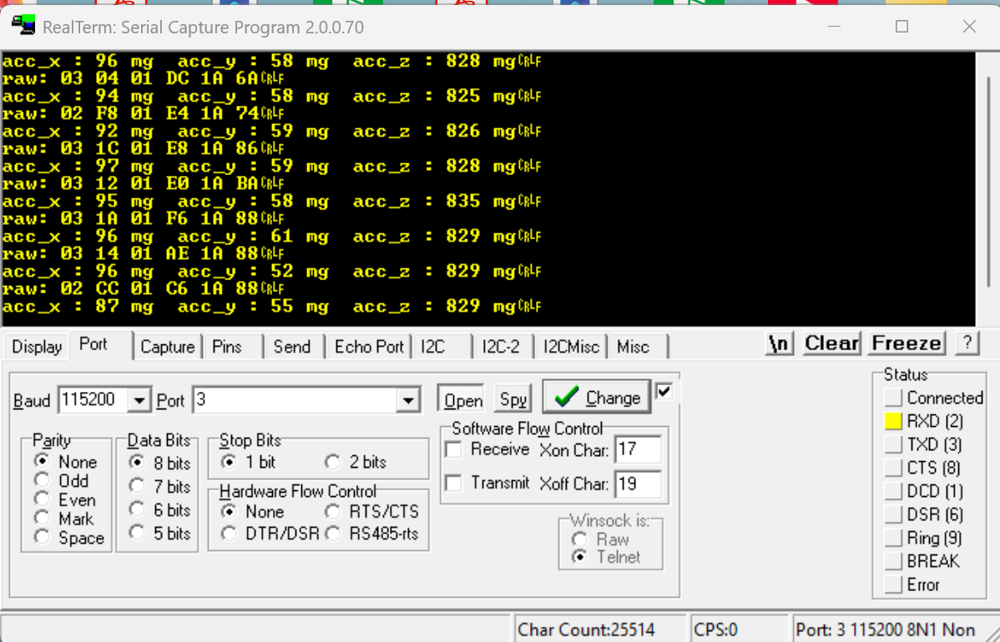
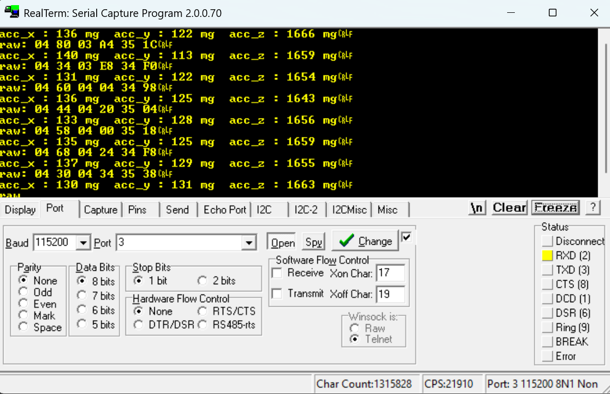

# STM32F411 Bare-Metal Drivers

Bare-metal peripheral drivers for the STM32F411 Nucleo-64, written in C against the CMSIS device headers with direct register access — no HAL or LL libraries.

## Drivers

### GPIO (`drivers/gpio/`)

Controls the Nucleo-64 on-board LED (PA5) and user button (PC13).

| Function | Description |
|---|---|
| `led_init()` | Enables GPIOA clock; configures PA5 as push-pull output |
| `led_on()` | Sets PA5 high via BSRR (atomic) |
| `led_off()` | Clears PA5 via BSRR (atomic) |
| `btn_init()` | Enables GPIOC clock; configures PC13 as input |
| `btn_state()` | Returns `true` when button is pressed (inverts active-low logic) |

---

### EXTI (`drivers/gpio/src/gpio_it.c`)

Interrupt-driven GPIO input, part of the GPIO driver (declared in `gpio.h` alongside the polling functions). Configures EXTI line 13 for the Nucleo-64 user button (PC13) with a falling-edge trigger.

A callback function is registered with `exti_register_callback()` before the interrupt is enabled. Any `void fn(void)` function can be passed, so different actions can be triggered by the same button press without modifying the driver — swap the callback to change the behaviour.

| Function | Description |
|---|---|
| `exti_init()` | Enables SYSCFG clock; maps PC13 to EXTI13; configures falling-edge trigger; enables NVIC |
| `exti_register_callback(cb)` | Registers `cb` as the function called on each button press |

> Always call `exti_register_callback()` before `exti_init()` — the interrupt is live as soon as `exti_init()` returns.

---

### UART (`drivers/uart/`)

Interrupt-driven USART2 TX driver on PA2, wired to the Nucleo's ST-LINK virtual COM port. A 256-byte ring buffer is drained by the USART2 TXE interrupt so `printf` returns immediately without stalling the CPU.

- **Baud rate:** 115200 @ 16 MHz HSI
- **Alternate function:** AF7
- **TX buffer:** 256-byte ring buffer, ISR-drained

| Function | Description |
|---|---|
| `uart_init()` | Enables clocks; configures PA2 as AF7; sets BRR; enables TE, UE, and NVIC |
| `__io_putchar()` | Newlib retargeting hook — connects `printf` / `putchar` to UART TX |

> TX only — no RX. Bytes dropped silently if the 256-byte ring buffer is full.

---

### SPI (`drivers/spi/`)

Full-duplex SPI1 master driver. Chip-select is managed by the device driver (PA4 for MPU-9250).

| Pin | Signal |
|---|---|
| PB3 | SCK |
| PB4 | MISO |
| PB5 | MOSI |

- **Mode:** 0 (CPOL=0, CPHA=0), MSB-first, 8-bit
- **Clock:** fPCLK/32 ≈ 500 kHz at 16 MHz
- **Alternate function:** AF5

| Function | Description |
|---|---|
| `spi_gpio_init()` | Configures PB3/4/5 as AF5 |
| `spi_init()` | Enables SPI1 clock; configures CR1; enables SPE |
| `spi_transceive(data)` | Blocking full-duplex transfer; returns received byte |

> Blocking/polling only. CS is the responsibility of the device driver. For DMA-based transfers see the DMA SPI driver below.
> Uses SPI1's alternate pin set (PB3/4/5) rather than the default (PA5/6/7) so PA5 stays free for the on-board LED (LD2) — see [Pin Summary](#pin-summary).

---

### DMA SPI (`drivers/dma/dma_spi/`)

DMA-driven SPI1 full-duplex transfer driver. Uses DMA2 Stream3 (TX) and Stream2 (RX) on channel 3, freeing the CPU during the transfer. Builds on top of the SPI driver — call `spi_gpio_init()` and `spi_init()` before `dma2_init()`.

- **TX:** DMA2 Stream3, Channel 3 (SPI1_TX), memory-to-peripheral
- **RX:** DMA2 Stream2, Channel 3 (SPI1_RX), peripheral-to-memory
- **Transfer size:** 8-bit (matches SPI1 8-bit frame)
- **Completion:** Transfer-complete interrupt on Stream2 (RX); CPU blocks in `spi_dma_transceive` until done

| Function | Description |
|---|---|
| `dma2_init()` | Enables DMA2 clock; enables SPI1 TXDMAEN/RXDMAEN; enables NVIC for Stream2/3 |
| `spi_dma_transceive(rx, tx, len)` | Full-duplex DMA transfer; blocks until RX complete |
| `spi_dma_transmit(tx, len)` | TX-only wrapper; RX is discarded into an internal dummy buffer |

> Always call `dma2_init()` after `spi_init()` — SPI1 must be clocked before its CR2 register is written. Always arm RX (Stream2) before TX (Stream3) to avoid losing the first received byte.

---

### I2C (`drivers/i2c/`)

I2C1 master driver on PB8 (SCL) and PB9 (SDA), configured for standard mode (100 kHz).

| Pin | Signal |
|---|---|
| PB8 | SCL |
| PB9 | SDA |

- **Mode:** Standard mode, 100 kHz
- **Alternate function:** AF4
- **Pull-ups:** Internal pull-ups enabled (open-drain output type)

| Function | Description |
|---|---|
| `i2c_init()` | Configures PB8/9 as AF4 open-drain; enables I2C1 clock; sets CCR and TRISE |
| `burst_read_reg(slave, target, n, buffer)` | Reads `n` bytes from register `target` on device `slave` into `buffer` |
| `write_reg(slave, target, data)` | Writes one byte `data` to register `target` on device `slave` |

> Polling only — interrupt-driven support planned. Addresses are 7-bit (not pre-shifted).

---

### SysTick (`drivers/systick/`)

Free-running millisecond tick counter and blocking delay, both built on the Cortex-M4 SysTick timer.

- **Clock source:** Processor clock (16 MHz)
- **Resolution:** 1 ms (LOAD = 15999)

| Function | Description |
|---|---|
| `start_timer()` | Configures SysTick for a 1 ms period and starts it, with `TICKINT` enabled; call once from `main()` before any `delay()` or `get_tick()` use |
| `delay(ms)` | Blocks for the given number of milliseconds, measured against `get_tick()` — does not reconfigure or stop SysTick |
| `get_tick()` | Returns the free-running millisecond count since `start_timer()` was called |
| `SysTick_Handler()` | ISR that increments the tick counter every 1 ms |

> `start_timer()` must be called exactly once, before any use of `delay()` or `get_tick()`. Unlike the old polling-only design, `delay()` no longer owns SysTick's configuration — it just waits on `get_tick()` — so the tick counter keeps running continuously across the whole program.

---

### MPU-9250 (`drivers/mpu9250/`)

Accelerometer/gyroscope driver for the InvenSense MPU-9250. Two transport implementations are provided — SPI and I2C — sharing the same function interface.

**Initialisation settings (both transports):**
- Wakes device from sleep (PWR_MGMT_1 = 0x00)
- Enables all accelerometer and gyro axes (PWR_MGMT_2 = 0x00)
- Sets accelerometer full-scale range to ±4 g (8192 LSB/g)
- DMA SPI transport also sets gyro full-scale range to ±250 °/s (131 LSB/°/s)

#### SPI transport (`mpu9250_spi.c / mpu9250_spi.h`)

Implements the MPU-9250 SPI protocol: bit 7 of the address byte selects read (1) or write (0); burst reads auto-increment the register address. CS is managed on PA4; SCK/MISO/MOSI use SPI1's alternate pin set (PB3/4/5) — see [Pin Summary](#pin-summary).

| Function | Description |
|---|---|
| `mpu_init()` | Configures PA4 as CS; wakes device; sets accel range |
| `mpu_read_reg(reg)` | Single register read; returns the byte |
| `mpu_write(reg, data)` | Writes one byte to a register |
| `mpu_burst_read(reg, length, buffer)` | Reads `length` bytes starting at `reg` into `buffer` |

There is no dedicated gyro-read function — call `mpu_burst_read(GYRO_XOUT_H, 6, buffer)` the same way as for `ACCEL_XOUT_H`.

#### I2C transport (`mpu9250_i2c.c / mpu9250_i2c.h`)

Uses the I2C1 bus driver. Device address: 0x68 (AD0 pin low).

| Function | Description |
|---|---|
| `mpu_init()` | Wakes device; sets accel range (`i2c_init()` called separately in main) |
| `mpu_write(reg, data)` | Writes one byte to a register |
| `mpu_burst_read(reg, buffer)` | Reads 6 bytes starting at `reg` into `buffer` |

> No magnetometer (AK8963) support.

---

### PWM (`drivers/pwm/`)

Two independent PWM drivers sharing one header (`pwm.h`) — see [`drivers/pwm/README.md`](drivers/pwm/README.md) for full detail.

| Driver | Timer/Pins | Purpose |
|---|---|---|
| `pwm_led.c` | TIM2 CH1, PA5 | Dims/brightens the on-board LED (LD2) |
| `quad_pwm.c` | TIM4 CH1-4, PB6/PB7/PB8/PB9 | General-purpose 4-channel PWM for motor/ESC control; caller picks channel and duty per call |

| Function | Description |
|---|---|
| `pwm_init(prescaler)` / `quad_pwm_init(prescaler)` | Configures clocks, GPIO alternate function, and PWM mode 1 for the respective timer |
| `set_duty_cycle(duty, period)` / `quad_pwm_set_duty(duty, period, channel)` | Sets period (`ARR`) and duty (`CCRx`, 0–100%) |
| `pwm_start()` / `quad_pwm_start()` | Enables the channel output(s) and starts the counter |

> `quad_pwm`'s 4 channels share one counter/prescaler/period — only duty is independent per channel. `PB6-9` are dedicated to `quad_pwm`; see [Pin Summary](#pin-summary).

---

### FreeRTOS (`third_party/FreeRTOS/`, `config/FreeRTOSConfig.h`)

Vendored FreeRTOS kernel (GCC/ARM_CM4F port, `heap_4` allocator), hand-configured
for this board rather than generated via CubeMX. Only compiled in for
FreeRTOS-based examples (`freertos_blink`, `freertos_sensor_blink`,
`freertos_button_preempt`) — see [Examples](#examples-examples) below.

- **Clock:** `configCPU_CLOCK_HZ` resolves through `SystemCoreClock`, defined
  in `drivers/systick/src/systick.c` (16 MHz HSI, no PLL)
- **Tick rate:** 1000 Hz (1 ms/tick)
- **Priorities:** `configMAX_PRIORITIES = 3` — Idle (0), `freertos_blink`/
  `freertos_sensor_blink` tasks (1), `freertos_button_preempt`'s button task (2).
  This one config is shared across all FreeRTOS examples in this repo, so it
  covers the highest priority any of them needs.
- **Stack overflow detection:** pattern-fill checking (`configCHECK_FOR_STACK_OVERFLOW = 2`);
  every FreeRTOS-based example must implement `vApplicationStackOverflowHook()`

> The bare-metal `delay()` in the SysTick driver must never be called once
> `vTaskStartScheduler()` has run — it directly writes SysTick's control
> register and permanently stops the RTOS tick. Use `vTaskDelay()` /
> `pdMS_TO_TICKS()` inside FreeRTOS tasks instead.

---

## Examples (`examples/`)

Each example demonstrates the full driver stack for a specific transport. Select which example to build with the `EXAMPLE` CMake variable (default: `mpu9250_accel_i2c`).

### led

Demonstrates EXTI interrupt-driven button input. Pressing the user button (PC13) triggers a falling-edge interrupt which sets a flag; the `while(1)` loop detects the flag, turns on LD2 (PA5) for one second, then turns it off. The ISR itself returns immediately — all blocking work stays in main context.

Because the driver uses a registered callback, the same button press can drive entirely different behaviour by passing a different function to `exti_register_callback()` — no changes to the driver required.

### mpu9250_accel_i2c

Initialises UART, I2C, and MPU-9250 (I2C transport), then continuously burst-reads the 6 accelerometer bytes (X/Y/Z high+low), reconstructs signed 16-bit values, converts to milli-g, and prints over UART at 500 ms intervals.

```
acc_x : -193 mg  acc_y : -760 mg  acc_z : 355 mg
```



### mpu9250_accel_spi

Same accelerometer readout over SPI. Also prints the WHO_AM_I register (expect 0x71) on startup.

```
WHO_AM_I: 0x71 (expect 0x71)
acc_x : 12 mg  acc_y : -8 mg  acc_z : 998 mg
```



### mpu9250_accel_spi_dma

Same accelerometer readout over SPI, using DMA for all transfers. The CPU is free during each SPI transaction and resumes only when the DMA transfer-complete interrupt fires. Also computes roll/pitch tilt angles from the accelerometer via `atan2f`, converted from radians to degrees. Initialises UART, SPI, DMA, and MPU-9250 (DMA SPI transport), then continuously burst-reads accelerometer data and prints milli-g values plus roll/pitch angles.

```
acc_x : 12 mg  acc_y : -8 mg  acc_z : 998 mg
roll_angle: 2 degrees   pitch angle: -1 degrees
```

> Requires linking against `libm` (`-lm`) for `atan2f`/`sqrtf`, and `-Wl,-u,_printf_float` for `%f`/float printf support under newlib-nano — both already set in `CMakeLists.txt`.

See [`examples/mpu9250_accel_spi_dma/README.md`](examples/mpu9250_accel_spi_dma/README.md) for details.

### mpu_gyro_spi_dma

Reads the MPU-9250 gyroscope (±250 °/s, 131 LSB/°/s) over SPI+DMA and integrates angular rate over time (`angle += rate × dt`) to estimate roll/pitch/yaw, using `get_tick()`/`start_timer()` from the SysTick driver to measure `dt` between samples. Demonstrates gyro-only orientation tracking and its core limitation — bias drift accumulates steadily even when stationary, which is why this is a stepping stone toward a complementary filter combining gyro and accelerometer data. See [`examples/mpu_gyro_spi_dma/README.md`](examples/mpu_gyro_spi_dma/README.md) for details.

### complementary_filter_spi_dma

Fuses the accelerometer and gyroscope from `mpu9250_accel_spi_dma` and `mpu_gyro_spi_dma` into drift-free roll/pitch estimates: `angle = α × (angle_prev + gyro_rate × dt) + (1 - α) × accel_angle`, with `α = 0.98`. Feeding the filter's own previous blended output back into the formula (rather than a separately-tracked raw gyro integration) is what lets the small accelerometer correction cancel gyro drift every iteration. No yaw — the accelerometer's gravity-vector reference can't correct yaw rotation, which would need a magnetometer. See [`examples/complementary_filter_spi_dma/README.md`](examples/complementary_filter_spi_dma/README.md) for details.

### kalman_filter_spi_dma

Same fusion goal as `complementary_filter_spi_dma`, but with a 2-state (angle + gyro bias) scalar Kalman filter per axis instead of a fixed blend weight — the correction strength (Kalman gain) is recalculated every iteration from a tracked uncertainty matrix, so it adapts to how much to currently trust the accelerometer rather than always using the same ratio. Also actively estimates and corrects gyro bias directly, rather than only correcting its symptom (drifted angle) after the fact. Tuning is empirical (`Q_angle`, `Q_bias`, `R_measure`). See [`examples/kalman_filter_spi_dma/README.md`](examples/kalman_filter_spi_dma/README.md) for the tuning process and a debugging note worth reading before modifying the timing logic.

### pwm_led

Drives the on-board LED (LD2, PA5) at a fixed, reduced brightness (25% duty cycle) via TIM2 Channel 1 PWM instead of simple digital on/off — demonstrates the `pwm_led.c` driver. See [`examples/pwm_led/README.md`](examples/pwm_led/README.md) for details.

### freertos_blink

First FreeRTOS-based example. A single task blinks LD2 (PA5) once per second via `vTaskDelay()`, demonstrating the minimum setup to run the scheduler on this board — one-time hardware init before `vTaskStartScheduler()`, then control never returns to `main()`. See [`examples/freertos_blink/README.md`](examples/freertos_blink/README.md) for details.

### freertos_sensor_blink

Two equal-priority tasks running concurrently: `led_blink` toggles LD2 (PA5) once per second, and `mpu_main` continuously burst-reads the MPU-9250 accelerometer over SPI1+DMA and prints milli-g values over UART, each on its own `vTaskDelay()`. Demonstrates round-robin scheduling between independent tasks with no shared state. SPI1 uses its alternate pin set (PB3/4/5) instead of the default (PA5/6/7) so LD2 (PA5) is free for the blink task — see [`examples/freertos_sensor_blink/README.md`](examples/freertos_sensor_blink/README.md) for details.

### freertos_button_preempt

Builds on `freertos_sensor_blink`'s two round-robin tasks and adds a third, higher-priority task woken by the user button's interrupt via a FreeRTOS task notification (`ulTaskNotifyTake` / `vTaskNotifyGiveFromISR` / `portYIELD_FROM_ISR`) — demonstrating genuine preemption rather than round-robin time-slicing. Pressing the button interrupts whichever background task was running and flashes LD2 rapidly before both resume. See [`examples/freertos_button_preempt/README.md`](examples/freertos_button_preempt/README.md) for details, including the NVIC-priority safety requirement for ISRs that call FreeRTOS API functions.

---

## Pin Summary

| Pin | Peripheral | Function |
|---|---|---|
| PA2 | USART2 | TX (AF7) |
| PA4 | SPI1 / MPU-9250 | Software CS (active-low) |
| PA5 | LED / TIM2_CH1 | LD2 output (digital or PWM via `pwm_led.c`) |
| PB3 | SPI1 | SCK (AF5) |
| PB4 | SPI1 | MISO (AF5) |
| PB5 | SPI1 | MOSI (AF5) |
| PB6 | TIM4_CH1 | `quad_pwm` channel 1 (AF2) |
| PB7 | TIM4_CH2 | `quad_pwm` channel 2 (AF2) |
| PB8 | TIM4_CH3 / I2C1 | `quad_pwm` channel 3 (AF2), or I2C1 SCL (AF4) — not used simultaneously |
| PB9 | TIM4_CH4 / I2C1 | `quad_pwm` channel 4 (AF2), or I2C1 SDA (AF4) — not used simultaneously |
| PC13 | — | User button input (active-low) |

> SPI1 uses its alternate pin set (PB3/4/5, AF5) rather than the default (PA5/6/7) specifically so PA5 stays dedicated to the on-board LED (LD2) — the two no longer conflict.
> PB8/PB9 are shared between `quad_pwm` (TIM4 CH3/CH4) and I2C1 — only use one at a time.

---

## Build

The project uses CMake with an ARM GCC toolchain. A VS Code launch configuration with OpenOCD is included for flashing and debugging.

```bash
# Build the LED/EXTI example
cmake -B build -DEXAMPLE=led -G "MinGW Makefiles"
cmake --build build

# Build the default example (mpu9250_accel_i2c)
cmake -B build -G "MinGW Makefiles"
cmake --build build

# Build the SPI example instead
cmake -B build -DEXAMPLE=mpu9250_accel_spi -G "MinGW Makefiles"
cmake --build build

# Build the DMA SPI example
cmake -B build -DEXAMPLE=mpu9250_accel_spi_dma -G "MinGW Makefiles"
cmake --build build

# Build the gyro integration example
cmake -B build -DEXAMPLE=mpu_gyro_spi_dma -G "MinGW Makefiles"
cmake --build build

# Build the complementary filter example
cmake -B build -DEXAMPLE=complementary_filter_spi_dma -G "MinGW Makefiles"
cmake --build build

# Build the Kalman filter example
cmake -B build -DEXAMPLE=kalman_filter_spi_dma -G "MinGW Makefiles"
cmake --build build

# Build the PWM LED example
cmake -B build -DEXAMPLE=pwm_led -G "MinGW Makefiles"
cmake --build build

# Build the FreeRTOS blink example
cmake -B build -DEXAMPLE=freertos_blink -G "MinGW Makefiles"
cmake --build build

# Build the FreeRTOS sensor + blink example
cmake -B build -DEXAMPLE=freertos_sensor_blink -G "MinGW Makefiles"
cmake --build build

# Build the FreeRTOS button preemption example
cmake -B build -DEXAMPLE=freertos_button_preempt -G "MinGW Makefiles"
cmake --build build
```

> Switching `EXAMPLE` in an existing `build/` directory requires re-running the
> `cmake -B build -DEXAMPLE=...` configure step, not just `cmake --build build`
> — otherwise the cached `EXAMPLE` value from the previous configure is used.

Flash via OpenOCD or the VS Code **Run and Debug** panel.

---

## Target

| | |
|---|---|
| MCU | STM32F411RE |
| Board | Nucleo-64 |
| Core | Cortex-M4 |
| Clock | 16 MHz HSI (no PLL configured) |
| Headers | CMSIS STM32F4xx |
